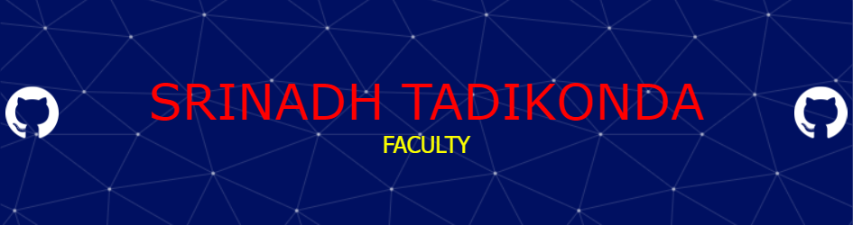

<!--
**srinadhtadikonda/srinadhtadikonda** is a ✨ _special_ ✨ repository because its `README.md` (this file) appears on your GitHub profile.

Here are some ideas to get you started:

- 🔭 I’m currently working on ...
- 🌱 I’m currently learning ...
- 👯 I’m looking to collaborate on ...
- 🤔 I’m looking for help with ...
- 💬 Ask me about ...
- 📫 How to reach me: ...
- 😄 Pronouns: ...
- ⚡ Fun fact: ...
-->
My Skills 

    

                          

    

    

https://roadmap.sh/u/srinadhtadikonda

    

  

    

    

## GSSOC(24) Badges 🪶

  

# 📊 GitHub Stats:

 

 

## 🏆 GitHub Trophies

<!--START_SECTION:waka-->

<h3 align="left">Connect with me:</h3>

  

